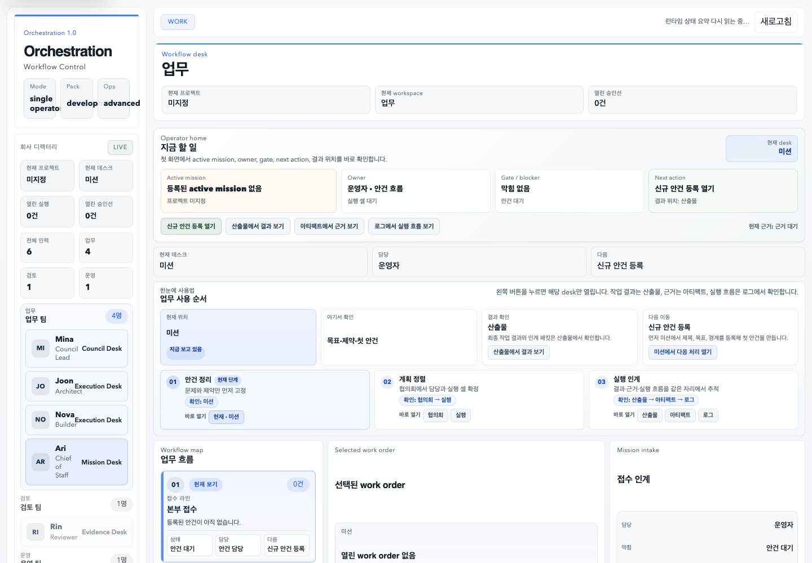
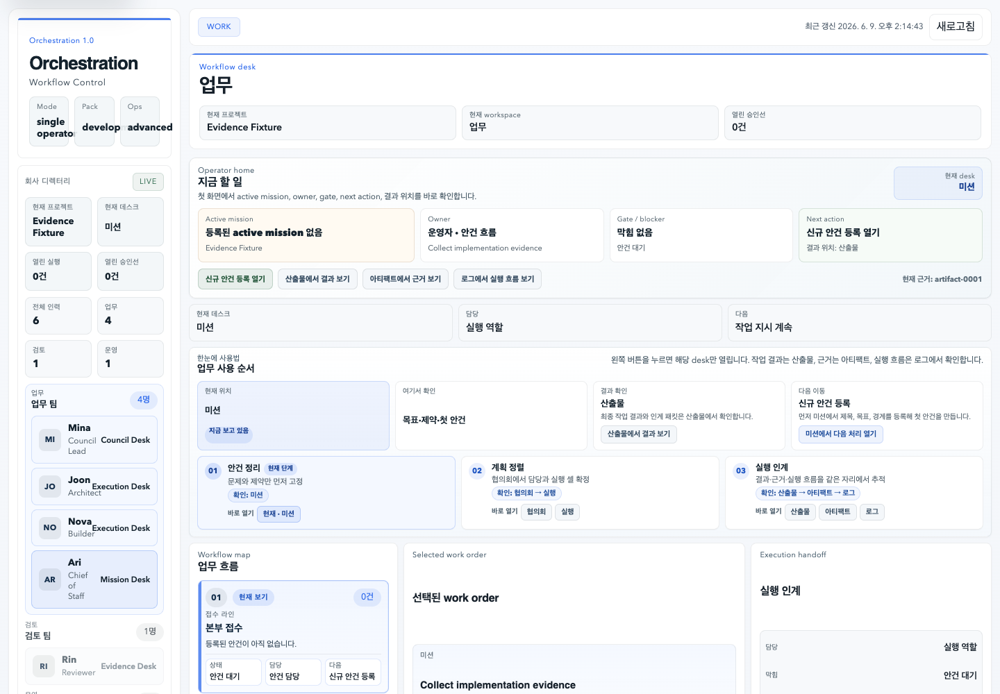

# Orchestration 1.0

> AI 워크플로의 **실행 흐름 · 상태 전이 · 산출물 기록**을 control plane 관점에서 구조화한 local-first 실험 프로젝트(PoC).

단일 AI 기능을 호출하는 것보다, "어떤 작업이 어떤 순서로 실행되고 어디서 실패하며 어떤 상태로 관리되는가"를 **추적 가능한 구조**로 만드는 데 초점을 둡니다. project → mission → task → workflow → snapshot → artifact 흐름을 in-process 런타임과 파일 스토어로 구현했습니다.

> ⚠️ 상태: **PoC / local-first · single-user · ops-first**. 상용 분산 오케스트레이션 플랫폼이 아니며, 운영 수준의 분산 실행·모니터링·권한 관리는 포함하지 않습니다.

---

## Why I Built This

AI 기능이 많아질수록 실행 순서·실패 지점·상태 관리를 추적하기 어려워집니다. 단일 기능 구현보다 중요한 것은 **작업 실행 흐름과 상태를 관리하는 구조**라고 판단해, control plane 개념을 직접 구현하며 검증한 프로젝트입니다.

---

## Features

| Feature | 설명 |
|---------|------|
| Workflow 실행 런타임 | project_path 기반으로 mission/task를 생성하고 workflow를 실행 (`src/runtime`) |
| 상태 스냅샷 | 실행 후 상태 전이를 snapshot으로 기록 (in-process API 응답) |
| Execution coordinator | 작업 실행 조율 + provider 어댑터 (`src/execution`) |
| Provider 추상화 | OpenAI Responses 어댑터 + local-stub 어댑터 (오프라인 결정론 실행) |
| File-store 영속화 | 외부 DB 없이 로컬 파일 스토어로 상태·산출물 관리 (local-first) |
| UI Surfaces | mission / taskboard / artifact 표면 (정적 HTML/CSS/JS, `ui/`) |
| Execution gates | 실행 전 review·approval 게이트를 보존하는 ops-first 규칙 |

---

## Tech Stack

| Area | Stack |
|------|-------|
| Runtime | Node.js (ESM `.mjs` + CommonJS `.js`), 표준 라이브러리 중심 (외부 npm 의존 최소) |
| Execution | execution-coordinator, provider-adapter |
| Providers | OpenAI Responses API 어댑터, local-stub 어댑터 (+ retry policy) |
| Persistence | 로컬 파일 스토어 (`src/runtime/file-store.js`) |
| UI | 정적 HTML / CSS / JavaScript (`ui/`) |
| Verification | smoke-slice 하니스 (`node:assert/strict` 기반), harness 러너 |

---

## Architecture

```text
UI Surfaces (mission / taskboard / artifact)        ← ui/
        │
Project / Mission / Task Layer
        │
Workflow Execution Layer                            ← src/execution
   ├─ execution-coordinator
   └─ provider-adapter ─ OpenAI Responses / local-stub
        │
Runtime Service (state · contracts)                 ← src/runtime/runtime-service.js
        │
State Snapshot / Artifact Store (local file store)  ← src/runtime/file-store.js
        │
QA / Smoke-slice 검증 로그                            ← scripts/
```

런타임은 HTTP 서버가 아니라 **in-process 서비스**(`createRuntimeService`)로, smoke 스크립트와 UI가 동일한 파일 스토어 상태를 공유합니다.

---

## Key Design Decisions

- **local-first · single-user 선택** — v1 범위를 "development pack"으로 좁혀, 분산·멀티유저·OAuth 없이 실행 흐름과 상태 관리 구조 자체에 집중. (대신 운영 규모 확장성은 범위 밖)
- **provider abstraction (OpenAI + local-stub)** — 외부 LLM 없이도 결정론적으로 실행·검증할 수 있도록 local-stub 어댑터를 둠. 네트워크·키 없이 smoke 검증 가능.
- **file-store 영속화** — 외부 DB 의존을 없애 로컬에서 즉시 재현 가능. 상태·산출물을 파일로 추적해 control plane의 "관찰 가능성"을 단순하게 확보.
- **execution gate(approval/review)를 비협상 규칙으로** — 실행 전 승인·검토 게이트를 아키텍처에 고정해, 자동 실행이 baseline을 조용히 바꾸지 못하게 함.

---

## Getting Started

> 외부 npm 의존이 없어 Node.js만 있으면 실행됩니다 (별도 `npm install` 불필요).

```bash
# 사용 가능한 검증 하니스 목록
node scripts/harness-run.mjs list

# 특정 하니스 실행
node scripts/harness-run.mjs <harness-id>

# 개별 smoke-slice 직접 실행 (예: 부트스트랩)
node scripts/smoke-bootstrap-slice-01.mjs

# UI: 정적 파일을 브라우저에서 열기
#   ui/index.html  (런타임 파일 스토어 상태를 표시)
```

Local UI/API server로 확인하는 경우:

```bash
# 기본값: 127.0.0.1:4310
node scripts/serve-ui-slice-01.mjs --runtime-root /tmp/orchestration-demo-runtime

# 다른 터미널에서 snapshot 확인
curl http://127.0.0.1:4310/api/snapshot
```

최소 API demo flow:

```bash
curl -X POST http://127.0.0.1:4310/api/projects \
  -H 'content-type: application/json' \
  -d '{"name":"Local demo","projectPath":"/absolute/path/to/this/repo"}'

curl -X POST http://127.0.0.1:4310/api/tasks \
  -H 'content-type: application/json' \
  -d '{"title":"Demo task","intent":"Verify local-stub planner flow."}'

curl -X POST http://127.0.0.1:4310/api/tasks/task-0001/run-planner \
  -H 'content-type: application/json' \
  -d '{}'
```

상세 checklist는 [`docs/local-demo-checklist.md`](./docs/local-demo-checklist.md)에 정리했습니다.

런타임을 코드에서 직접 쓰는 경우:

```js
const { createRuntimeService } = require('./src/runtime/runtime-service.js');
const runtime = createRuntimeService({ /* project_path 등 */ });
```

> 실행에는 `project_path`가 선행되어야 합니다(비협상 규칙). 자세한 운영 규칙은 `AGENTS.md`, 설계는 `docs/`(00_master-brief ~ 03_architecture-roadmap-v1) 참고.

---

## Verification

정식 단위 테스트 스위트 대신, 개발 과정에서 **누적된 smoke-slice 하니스**로 실행 경로를 검증합니다.

```bash
ls scripts/ | grep -c "^smoke-"   # → 838  (smoke-slice 스크립트)
ls scripts/ | grep -c "qa-slice"  # → 10   (QA slice 러너)
```

- smoke 스크립트는 `node:assert/strict`로 런타임을 직접 import해 상태 전이·산출물 생성을 검증합니다.
- 숫자(838 / 10)는 `scripts/` 디렉터리의 파일 수를 직접 카운트한 값이며, **단위 테스트 케이스 수가 아니라 개발 슬라이스별 smoke 스크립트 수**입니다.
- 각 하니스의 현재 pass 여부는 `node scripts/harness-run.mjs doctor` / 개별 실행으로 재확인하세요.
- 대표 local user-flow smoke 근거: [`evidence/cli-logs/smoke-v1-user-flow-kickoff-2026-06-22.status`](./evidence/cli-logs/smoke-v1-user-flow-kickoff-2026-06-22.status)

---

## Evidence & Screenshots

대표 UI evidence는 저장소의 정적 screenshot으로 확인할 수 있습니다. 아래 이미지는 hosted demo가 아니라 `evidence/screenshots/`에 보관된 로컬 캡처입니다.






- Evidence manifest: [`evidence/evidence_manifest.md`](./evidence/evidence_manifest.md)
- Architecture diagram evidence: [`evidence/architecture/`](./evidence/architecture/)
- CLI and smoke logs: [`evidence/cli-logs/`](./evidence/cli-logs/)

---

## Scope & Limitations

- 상용 orchestration platform이 아니라 **control plane 개념을 실험한 PoC**입니다.
- **local-first · single-user**: 분산 실행, 멀티유저, OAuth, 메신저/랭킹/조직관리 의미는 의도적으로 범위에서 제외했습니다.
- 운영 수준의 분산 실행 · 모니터링 · 권한 관리는 포함하지 않습니다.
- LLM provider는 OpenAI Responses + local-stub만 지원하며, multi-provider-first 구조가 아닙니다.
- 기본 검증 경로는 local-stub 중심입니다. OpenAI live provider 검증은 `OPENAI_API_KEY`와 `OPENAI_RESPONSES_MODEL`이 보이는 환경에서 별도 재실행해야 하는 optional path입니다.
- 검증되지 않은 성능·자동화율 수치는 사용하지 않습니다.

---

## Links

- GitHub: https://github.com/sungjin9288/orchestration
- Demo: (공개 시나리오 정리 후 추가)
- Screenshots / evidence: [`evidence/screenshots/`](./evidence/screenshots/), [`evidence/evidence_manifest.md`](./evidence/evidence_manifest.md)
- 운영 규칙 / 설계: [`AGENTS.md`](./AGENTS.md), [`DESIGN.md`](./DESIGN.md), [`docs/`](./docs/)
