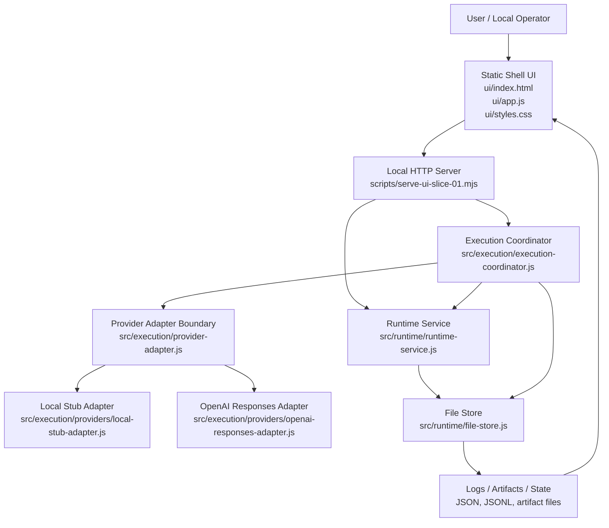
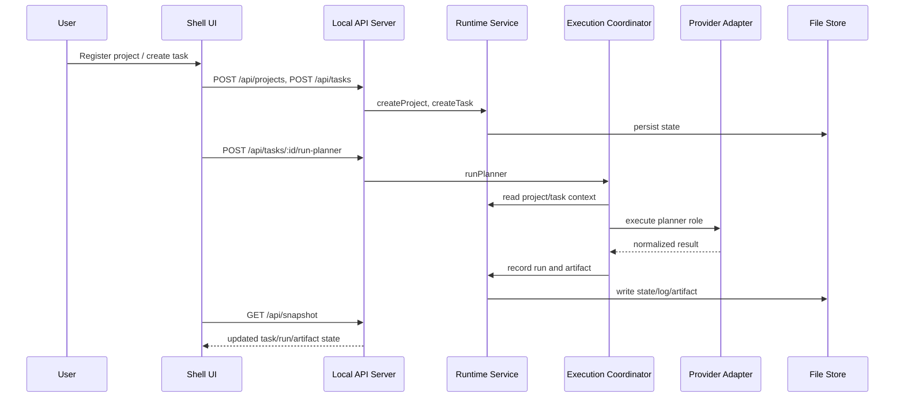

# Orchestration Architecture Evidence

## Architecture Diagram

## Sequence Diagram

## Evidence Basis

- `src/runtime/contracts.js`
- `src/runtime/runtime-service.js`
- `src/runtime/file-store.js`
- `src/execution/execution-coordinator.js`
- `src/execution/provider-adapter.js`
- `src/execution/providers/local-stub-adapter.js`
- `src/execution/providers/openai-responses-adapter.js`
- `scripts/serve-ui-slice-01.mjs`
- `ui/index.html`
- `ui/app.js`
