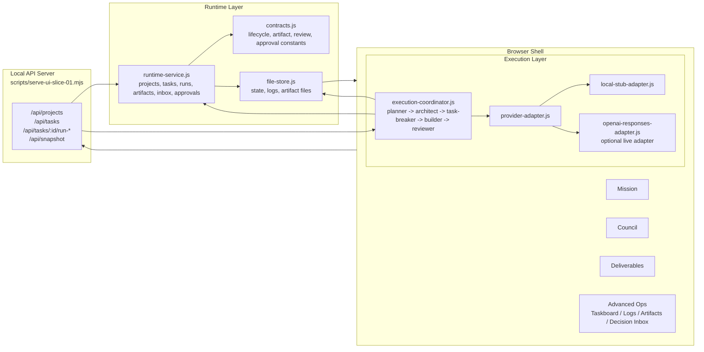

# Workflow Architecture Diagram

## Captured Evidence

- `evidence/config-evidence/workflow-config-evidence.md`
- `evidence/state-transitions/state-transition-summary.md`
- `evidence/workflow-logs/workflow-api-sequence.status`
