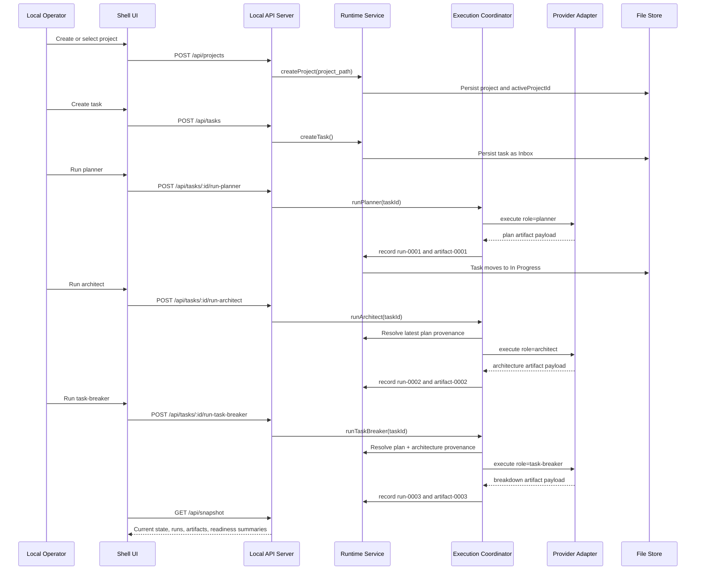

# Workflow Sequence Diagram

## Captured Evidence

- `evidence/state-transitions/03-run-planner-response.json`
- `evidence/state-transitions/04-run-architect-response.json`
- `evidence/state-transitions/05-run-task-breaker-response.json`
- `evidence/state-transitions/state-transition-summary.md`
